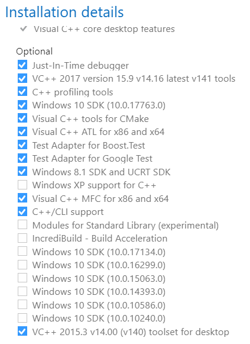
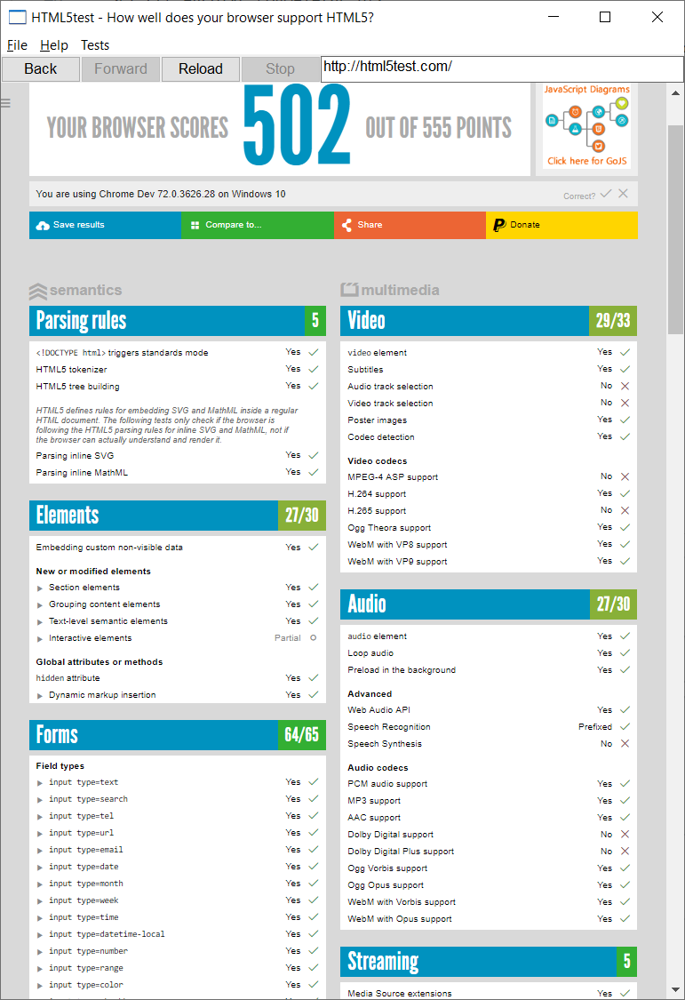

cef 3.3626 (Chrome Dev 72.0.3626.28) 加入 FFmpeg (H.264/AAC 解碼器) 的編譯過程
=======

`Chromium Embedded Framework` 主要提供 Hybrid Desktop APP (Web + Native) 的解決方案，這邊註解下編譯 `cef 3.3626 (Chrome Dev 72.0.3626.28)` 的過程，並附上 FFmpeg 所支持的編譯結果 `cef_binary_3.3626.1866.g0e1d6c6_windows32.part01~3.rar`。

為何 `cef` 而不是 `Electron` 或 `QtWebEngine`，這邊與 [跨平台解决方案中，Qt 和 Electron 孰优孰劣？ - 欲三更的回答 - 知乎](https://www.zhihu.com/question/53230344/answer/134672896) 的見解差不多。

由於 CSDN 已有眾多編譯的結果，但無奈沒有積分無法下載，於是花了點時間硬幹了一下。建議在硬幹前先詳細觀察下列的文章，尤其是 `BranchesAndBuilding` ，裡頭詳細記載 cef 搭配的 VisualStudio 與其 SDK 版本號。

* [BranchesAndBuilding](https://bitbucket.org/chromiumembedded/cef/wiki/BranchesAndBuilding.md)
* [编译带 ffmpeg（支持MP3/MP4等) 的CEF（Windows x86 + macOS x64）遇到的一些问题记录](https://blog.csdn.net/epubcn/article/details/81093752)
* [在Windows上编译 CEF3 且加入mp3/mp4的支持](https://blog.csdn.net/baidu_32237719/article/details/79509819)

編譯環境 Host 端
--------

*	**Win10 1809 x64 (Build 17763.195)**
  
*	**Visual 2017 Community 與其 SDK，安裝模組如**
    
	

*	**Windows 10.0.17134.12 SDK (Win10 1803)**
  
	此 SDK 要 [另外下載](https://developer.microsoft.com/zh-tw/windows/downloads/sdk-archive)，使用 Visual 2017 Community 裡的 SDK 似乎不提供些 dbghelp.dll 檔案。另外是基於 Win10 1803 SDK 編譯所以 Target 是否支援 Win10 1803 以前的版本則這邊並沒有測試。
  
  
*	**Nijina-1.8.2 for windows 下載並放置於 C:\Ninja\nijia.exe，並加入 %PATH%**
    
*	**建立 D:\cef 資料夾**
    
*	**下載 automate-git.py 並置於 D:\cef**
  
*	**下載下列 build_3626.bat 並置於 D:\cef**

*	**開啟 cmd.exe，並執行 D:\cef\build_3626.bat**
  

build_3626.bat
--------

	set CEF_USE_GN=1
	set GN_DEFINES=is_official_build=true proprietary_codecs=true ffmpeg_branding=Chrome
	set GYP_DEFINES=buildtype=Official
	set GYP_MSVS_VERSION=2017
	set CEF_ARCHIVE_FORMAT=tar.bz2
	set GN_ARGUMENTS=--ide=vs2017 --sln=cef --filters=//cef/*
	python automate-git.py --download-dir=D:\cef\build_3626 --branch=3626 --force-build --force-clean --minimal-distrib --client-distrib

*	**proprietary_codecs=true ffmpeg_branding=Chrome**
  
	這邊可以加入 H.264/AAC 的支援。這是其中一種改法，據說還有另一種改在 Code 裡。
  
*	**--branch=3626**

	branch 3626 對應 Chromium Version 72。
  

HTML5Test 裡顯示 H.264 與 AAC 已被致能
--------

